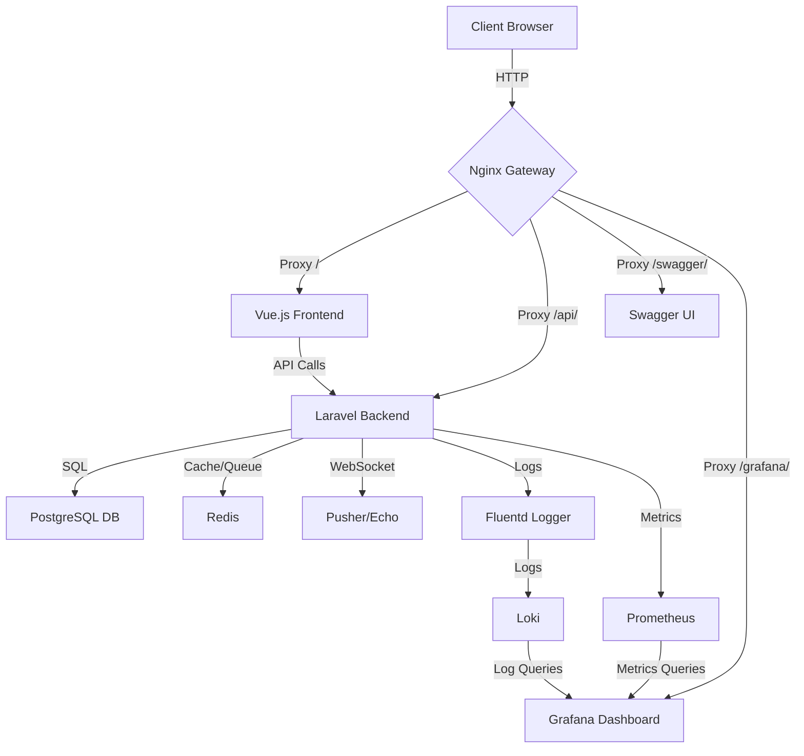

# ECommerceTenancy

一個專為餐飲業設計的多租戶 SaaS 平台，使用 Laravel（後端）和 Vue.js（前端）構建。本項目提供全面的餐廳管理功能，包括叫號系統、桌位管理、促銷模組、即時通知以及進階監控功能。倉庫僅包含核心代碼，需自行安裝 Laravel 基本代碼並進行整合。

## 專案架構圖
以下是專案的整體架構圖，展示前端、後端、資料庫和監控服務之間的關係：



**架構說明**：
- **Nginx Gateway**：作為反向代理，處理前端、API、Swagger UI 和 Grafana 的請求，支援子域名路由（例如 `tenanta.localhost`）。
- **Vue.js Frontend**：提供用戶界面，包括公開叫號顯示和桌位管理。
- **Laravel Backend**：處理 API 請求，實現多租戶邏輯、認證、叫號、桌位管理和促銷。
- **PostgreSQL**：儲存多租戶資料（用戶、產品、訂單、桌位等）。
- **Redis**：用於快取和佇列管理。
- **Pusher/Echo**：支援 WebSocket 即時通知（例如叫號狀態更新）。
- **Fluentd + Loki**：集中式日誌收集與可視化。
- **Prometheus + Grafana**：監控指標與儀表板。

## 功能
- **多租戶架構**：基於資料列的分租戶設計，支援子域名（如 `tenanta.localhost`、`tenantb.localhost`）。
- **叫號系統**：即時外帶叫號追蹤，支援 WebSocket 更新及公開叫號顯示。
- **桌位管理**：管理內用桌位狀態（空閒、使用中、預訂、清潔中）。
- **促銷模組**：支援動態促銷，包含靈活的 JSON 規則。
- **即時通知**：基於 WebSocket 的訂單狀態更新及 LINE Notify 整合。
- **顧客行為追蹤**：記錄用戶交互行為，用於分析和行銷。
- **高可用性部署**：使用 Nginx 作為 API 網關，包含健康檢查和 Docker Compose 部署。
- **集中式日誌管理**：Fluentd 搭配 Loki 實現持久化日誌儲存與可視化。
- **監控系統**：Prometheus 和 Grafana 提供效能指標和儀表板。
- **JWT 認證**：安全的用戶註冊、登入和基於角色的訪問控制（RBAC）。
- **API 文件**：使用 OpenAPI 和 Swagger UI 提供易於探索的 API 文件。
- **測試覆蓋**：核心功能的全面 PHPUnit 測試（認證、叫號、促銷等）。

## 前置要求
- Docker 和 Docker Compose
- Node.js（前端開發）
- PHP 8.2+ 和 Composer（後端開發）
- 本地 hosts 文件配置子域名

## 安裝步驟
由於倉庫僅包含核心代碼（不含 Laravel 的基本框架檔案），您需要先安裝 Laravel 並將倉庫中的代碼整合進去。以下是詳細步驟：

1. **克隆倉庫**：
   ```bash
   git clone https://github.com/BpsEason/ECommerceTenancy.git
   cd ECommerceTenancy
   ```

2. **設置 Laravel 專案**：
   - 安裝一個新的 Laravel 專案（假設在 `backend` 目錄）：
     ```bash
     composer create-project laravel/laravel backend
     cd backend
     ```
   - 複製倉庫中的 `backend` 目錄中的核心代碼（`app`、`database`、`routes`、`tests` 等）到新創建的 Laravel 專案中：
     ```bash
     cp -r ../backend/app ./app
     cp -r ../backend/database ./database
     cp -r ../backend/routes ./routes
     cp -r ../backend/tests ./tests
     cp ../backend/.env.example ./.env.example
     ```
   - 安裝必要的 Composer 依賴（根據 `composer.json`）：
     ```bash
     composer require laravel/sanctum laravel/tinker predis/predis tymon/jwt-auth laravel/breeze
     composer require --dev fakerphp/faker laravel/pint laravel/sail mockery/mockery nunomaduro/collision phpunit/phpunit spatie/laravel-ignition
     ```
   - 生成應用程式密鑰和 JWT 密鑰：
     ```bash
     cp .env.example .env
     php artisan key:generate
     php artisan jwt:secret
     ```

3. **配置 Hosts 文件**：
   在您的 hosts 文件（Linux/macOS 的 `/etc/hosts` 或 Windows 的 `C:\Windows\System32\drivers\etc\hosts`）中添加以下內容：
   ```bash
   127.0.0.1 tenanta.localhost
   127.0.0.1 tenantb.localhost
   127.0.0.1 test.localhost
   ```

4. **設置前端**：
   - 進入 `frontend` 目錄並安裝依賴：
     ```bash
     cd ../frontend
     npm install
     ```
   - 複製倉庫中的前端代碼（`src`、`package.json`、`vite.config.js` 等）到前端專案目錄。

5. **啟動服務**：
   使用 Docker Compose 構建並運行所有服務（確保 `docker-compose.yml` 已從倉庫複製到根目錄）：
   ```bash
   cd ..
   docker-compose up -d --build
   ```

6. **執行資料庫遷移和種子數據**：
   初始化資料庫並填充範例數據：
   ```bash
   docker-compose exec backend php artisan migrate --seed
   ```

7. **訪問平台**：
   - **前端**：http://localhost:3000
   - **API 網關**：http://tenanta.localhost
   - **API 文件（Swagger）**：http://localhost/swagger/
   - **公開叫號顯示**：http://localhost:3000/queue/display
   - **Grafana 儀表板**：http://localhost:3001（帳號：admin，密碼：password）
   - **Prometheus 指標**：http://localhost:9090

8. **配置 Grafana**：
   - 在 http://localhost:3001 使用 `admin/password` 登入 Grafana。
   - 添加數據源：
     - **Prometheus**：URL 為 `http://prometheus:9090`
     - **Loki**：URL 為 `http://loki:3100`
   - 創建儀表板以可視化指標和日誌。

## 添加新餐廳
透過 API 創建新租戶（餐廳）：
```bash
curl -X POST http://localhost/api/v1/tenants \
  -H "Content-Type: application/json" \
  -d '{"id":"newtenant","name":"New Restaurant","subdomain":"newtenant","currency":"TWD","role":"admin","line_notify_token":"YOUR_TOKEN"}'
```
然後在 hosts 文件中添加 `127.0.0.1 newtenant.localhost`。

## 執行測試
運行後端的 PHPUnit 測試：
```bash
cd backend
docker-compose exec backend vendor/bin/phpunit
```

## 關鍵代碼片段（帶註解）

以下是一些關鍵代碼片段，選自倉庫中的核心代碼，並添加了詳細的中文註解以便理解：

### 1. 叫號系統控制器 (`QueueController.php`)
```php
<?php

namespace App\Http\Controllers;

use App\Models\Queue;
use Illuminate\Http\Request;
use Illuminate\Support\Facades\DB;
use App\Events\QueueUpdated;

class QueueController extends Controller
{
    /**
     * 公開叫號狀態端點，無需認證即可訪問
     * 返回當前服務中的號碼和等待清單
     */
    public function publicQueue()
    {
        // 查詢狀態為「等待」的號碼，按創建時間排序，最多返回 10 個
        $next_numbers = DB::table('queues')
                          ->where('status', 'waiting')
                          ->orderBy('created_at', 'asc')
                          ->limit(10)
                          ->get(['id', 'queue_number', 'status']);

        // 查詢當前服務中的號碼（最新更新的）
        $serving_number = DB::table('queues')
                            ->where('status', 'serving')
                            ->orderBy('updated_at', 'desc')
                            ->first(['id', 'queue_number', 'status']);

        // 返回 JSON 格式的響應，包含當前服務號碼和等待清單
        return response()->json([
            'currently_serving' => $serving_number ? $serving_number->queue_number : null,
            'waiting_list' => $next_numbers,
        ]);
    }

    /**
     * 前進叫號（需要認證，僅限管理員）
     * 將第一個等待號碼設置為服務中，並廣播更新
     */
    public function advanceQueue(Request $request)
    {
        // 使用事務確保資料一致性
        DB::transaction(function () {
            // 查詢第一個等待中的號碼
            $nextWaiting = DB::table('queues')
                             ->where('status', 'waiting')
                             ->orderBy('created_at', 'asc')
                             ->first();

            if ($nextWaiting) {
                // 將當前服務中的號碼設為「已完成」
                DB::table('queues')->where('status', 'serving')->update(['status' => 'completed']);
                // 將下一個等待號碼設為「服務中」
                DB::table('queues')->where('id', $nextWaiting->id)->update(['status' => 'serving']);

                // 獲取更新後的服務號碼和等待清單
                $newServing = DB::table('queues')->where('id', $nextWaiting->id)->first();
                $waitingList = DB::table('queues')->where('status', 'waiting')->orderBy('created_at', 'asc')->limit(10)->get();
                
                // 透過 WebSocket 廣播更新給所有客戶端（除了發起者）
                broadcast(new QueueUpdated([
                    'currently_serving' => $newServing->queue_number,
                    'waiting_list' => $waitingList
                ]))->toOthers();
            }
        });

        // 返回成功訊息
        return response()->json(['message' => 'Queue advanced.']);
    }

    /**
     * 添加新叫號（範例實現）
     * 生成隨機號碼並加入等待清單
     */
    public function addNumber(Request $request)
    {
        // 生成隨機叫號（僅為演示，實際應用應使用更穩定的邏輯）
        $newNumber = rand(100, 999);
        DB::table('queues')->insert([
            'queue_number' => $newNumber,
            'status' => 'waiting',
            'created_at' => now(),
            'updated_at' => now()
        ]);
        return response()->json(['message' => 'Number added to queue.', 'number' => $newNumber]);
    }
}
```

**代碼說明**：
- `publicQueue`：公開端點，無需認證，供餐廳公開顯示叫號狀態，模擬餐廳叫號螢幕。
- `advanceQueue`：管理員專用，推進叫號流程，使用事務確保資料一致性，並透過 WebSocket 即時通知更新。
- `addNumber`：簡單的範例功能，模擬顧客取號。

### 2. 桌位管理控制器 (`TableController.php`)
```php
<?php

namespace App\Http\Controllers;

use App\Models\Table;
use Illuminate\Http\Request;
use Illuminate\Support\Facades\Gate;

class TableController extends Controller
{
    /**
     * 獲取所有桌位（僅限授權用戶）
     * 返回租戶下的所有桌位資料
     */
    public function index()
    {
        // 使用 Gate 檢查用戶是否有權限查看桌位
        Gate::authorize('viewAny', Table::class);
        return Table::all();
    }

    /**
     * 顯示單一桌位詳情
     * 需要授權，確保用戶有權限查看特定桌位
     */
    public function show(Table $table)
    {
        Gate::authorize('view', $table);
        return $table;
    }

    /**
     * 創建新桌位
     * 驗證輸入並確保桌號唯一
     */
    public function store(Request $request)
    {
        Gate::authorize('create', Table::class);

        // 驗證輸入資料
        $validated = $request->validate([
            'number' => 'required|string|max:255|unique:tables,number',
            'capacity' => 'required|integer|min:1',
            'status' => 'required|in:available,occupied,reserved,cleaning'
        ]);

        // 創建桌位並返回
        return Table::create($validated);
    }

    /**
     * 更新桌位資料
     * 允許部分更新，確保桌號唯一性
     */
    public function update(Request $request, Table $table)
    {
        Gate::authorize('update', $table);

        $validated = $request->validate([
            'number' => 'sometimes|required|string|max:255|unique:tables,number,' . $table->id,
            'capacity' => 'sometimes|required|integer|min:1',
            'status' => 'sometimes|required|in:available,occupied,reserved,cleaning'
        ]);

        $table->update($validated);
        return $table;
    }

    /**
     * 刪除桌位
     * 僅限授權用戶執行
     */
    public function destroy(Table $table)
    {
        Gate::authorize('delete', $table);
        $table->delete();
        return response()->noContent();
    }
}
```

**代碼說明**：
- 使用 `Gate` 進行權限檢查，確保只有授權用戶（例如管理員）可以管理桌位。
- 支援完整的 CRUD 操作，包含輸入驗證和唯一性檢查。
- `status` 欄位支援餐飲業常見的桌位狀態，適合內用場景。

### 3. 前端公開叫號顯示組件 (`QueueDisplay.vue`)
```vue
<template>
  <div class="flex flex-col items-center justify-center min-h-screen bg-gray-900 text-white">
    <div class="text-center p-8 bg-gray-800 rounded-lg shadow-2xl w-full max-w-4xl mx-auto">
      <h1 class="text-6xl font-extrabold mb-8 animate-pulse">{{ $t('queue.title') }}</h1>

      <div class="mb-12">
        <p class="text-4xl font-semibold mb-4 text-gray-400">{{ $t('queue.currently_serving') }}</p>
        <div class="bg-indigo-600 p-8 rounded-full shadow-inner border-4 border-indigo-400 transform transition-transform duration-500 hover:scale-105">
          <p v-if="currentlyServing" class="text-8xl font-black text-white tracking-widest">{{ currentlyServing }}</p>
          <p v-else class="text-6xl font-black text-gray-300">{{ $t('queue.no_number') }}</p>
        </div>
      </div>

      <div>
        <p class="text-3xl font-semibold mb-6 text-gray-400">{{ $t('queue.waiting_list') }}</p>
        <div v-if="waitingList.length > 0" class="grid grid-cols-2 sm:grid-cols-3 md:grid-cols-5 gap-6">
          <div
            v-for="item in waitingList"
            :key="item.id"
            class="bg-gray-700 p-6 rounded-xl shadow-lg border-2 border-gray-600 transition-all duration-300 hover:shadow-xl hover:bg-gray-600"
          >
            <p class="text-5xl font-bold text-teal-400">{{ item.queue_number }}</p>
          </div>
        </div>
        <p v-else class="text-4xl text-gray-500 italic mt-8">{{ $t('queue.no_waiting') }}</p>
      </div>
    </div>
  </div>
</template>

<script setup>
import { ref, onMounted, onUnmounted } from 'vue';
import { useI18n } from 'vue-i18n';

const { t } = useI18n();
const currentlyServing = ref(null); // 當前服務中的號碼
const waitingList = ref([]); // 等待清單

// 獲取叫號狀態的函數
const fetchQueueStatus = async () => {
  try {
    const response = await fetch('/api/queue/public'); // 調用公開叫號 API
    const data = await response.json();
    currentlyServing.value = data.currently_serving;
    waitingList.value = data.waiting_list;
  } catch (error) {
    console.error("Failed to fetch queue status:", error);
  }
};

// 在組件掛載時獲取初始狀態
onMounted(() => {
  fetchQueueStatus();

  // 以下為 WebSocket 監聽範例（已註解，需配置 Pusher/Echo）
  // window.Echo = new Echo({
  //   broadcaster: 'pusher',
  //   key: import.meta.env.VITE_WEBSOCKET_APP_KEY,
  //   cluster: import.meta.env.VITE_WEBSOCKET_APP_CLUSTER ?? 'mt1',
  //   wsHost: import.meta.env.VITE_WEBSOCKET_HOST ? import.meta.env.VITE_WEBSOCKET_HOST : `ws-${window.location.hostname}`,
  //   wsPort: import.meta.env.VITE_WEBSOCKET_PORT ?? 6001,
  //   wssPort: import.meta.env.VITE_WEBSOCKET_PORT ?? 6001,
  //   forceTLS: import.meta.env.VITE_WEBSOCKET_FORCE_TLS ?? false,
  //   enabledTransports: ['ws', 'wss'],
  // });
  //
  // window.Echo.channel('public-queue')
  //   .listen('.queue.updated', (e) => {
  //     console.log('Real-time queue update received:', e);
  //     currentlyServing.value = e.queue.currently_serving;
  //     waitingList.value = e.queue.waiting_list;
  //   });
});

// 組件卸載時清理 WebSocket 連線
onUnmounted(() => {
  // window.Echo.leave('public-queue');
});
</script>

<style scoped>
/* 自訂樣式 */
</style>
```

**代碼說明**：
- 使用 Tailwind CSS 打造現代化的叫號顯示界面，顯示當前服務號碼和等待清單。
- 支援多語言（透過 `vue-i18n`），預設為繁體中文。
- 包含 WebSocket 監聽的範例程式碼（已註解），可與後端的 `QueueUpdated` 事件整合。

### 4. 監控中介軟體 (`RecordMetrics.php`)
```php
<?php

namespace App\Http\Middleware;

use Closure;
use Illuminate\Http\Request;
use Symfony\Component\HttpFoundation\Response;
use Prometheus\CollectorRegistry;
use Prometheus\Storage\Redis;

class RecordMetrics
{
    /**
     * 處理 HTTP 請求並記錄監控指標
     * 將 HTTP 請求計數記錄到 Prometheus
     */
    public function handle(Request $request, Closure $next): Response
    {
        $response = $next($request); // 執行下一個中介軟體或控制器

        try {
            // 使用 Redis 作為 Prometheus 儲存後端
            $registry = CollectorRegistry::getInstance(new Redis(['host' => env('REDIS_HOST', 'redis')]));

            // 記錄 HTTP 請求總數，包含方法、路徑和狀態碼
            $counter = $registry->getOrRegisterCounter(
                'ecommerce_platform', // 名稱空間
                'http_requests_total', // 指標名稱
                'Total HTTP requests to the application', // 描述
                ['method', 'endpoint', 'status_code'] // 標籤
            );
            $counter->inc([$request->method(), $request->path(), (string) $response->getStatusCode()]);
        } catch (\Throwable $e) {
            // 記錄監控失敗的日誌，確保系統穩定性
            \Log::error('Prometheus metric recording failed: ' . $e->getMessage());
        }

        return $response;
    }
}
```

**代碼說明**：
- 記錄每個 HTTP 請求的指標（方法、路徑、狀態碼），並儲存到 Redis 以供 Prometheus 收集。
- 異常處理確保監控失敗不會影響應用程式運行。
- 可與 Grafana 整合，展示 API 請求的效能數據。

## 開發
- **後端**：在 `backend` 目錄中修改 Laravel 程式碼，使用 `php artisan` 命令進行遷移、種子數據等操作。
- **前端**：在 `frontend/src` 目錄中開發 Vue.js 組件，運行 `npm run dev` 啟動開發服務器。
- **API 文件**：更新 `docs/api.yaml` 以反映新的端點或更改。

## 目錄結構
```
ECommerceTenancy/
├── backend/                    # Laravel 後端核心代碼（需整合至新 Laravel 專案）
│   ├── app/
│   │   ├── Http/
│   │   │   ├── Controllers/   # API 控制器（認證、產品、叫號等）
│   │   │   ├── Middleware/    # 自訂中介軟體（例如 RecordMetrics）
│   │   ├── Models/           # Eloquent 模型（User、Tenant、Product 等）
│   │   ├── Services/         # 插件管理（例如通知）
│   │   ├── Events/           # WebSocket 事件（例如 QueueUpdated）
│   │   ├── Providers/        # 服務提供者（例如 BroadcastServiceProvider）
│   ├── database/
│   │   ├── migrations/       # 資料庫遷移
│   │   ├── seeders/          # 資料庫種子數據
│   ├── tests/Feature/        # PHPUnit 測試
├── frontend/                   # Vue.js 前端
│   ├── src/
│   │   ├── api/              # API 客戶端程式碼
│   │   ├── components/       # Vue 組件（例如 TableManagement、QueueDisplay）
│   │   ├── views/            # 頁面組件
│   │   ├── router/           # Vue Router 配置
│   │   ├── locales/          # i18n 翻譯
├── monitoring/                 # 監控配置
│   ├── nginx.conf            # Nginx 網關配置
│   ├── fluentd.conf          # Fluentd 日誌配置
│   ├── loki-config.yml       # Loki 配置
│   ├── prometheus.yml        # Prometheus 配置
├── docs/                      # API 文件
│   ├── api.yaml              # OpenAPI 規範
├── docker-compose.yml          # Docker Compose 配置
├── .github/workflows/ci.yml    # CI/CD 管道
```

## 貢獻
1. Fork 本倉庫。
2. 創建功能分支（`git checkout -b feature/new-feature`）。
3. 提交更改（`git commit -m "Add new feature"`）。
4. 推送分支（`git push origin feature/new-feature`）。
5. 創建 Pull Request。

## 許可證
本項目採用 MIT 許可證。
