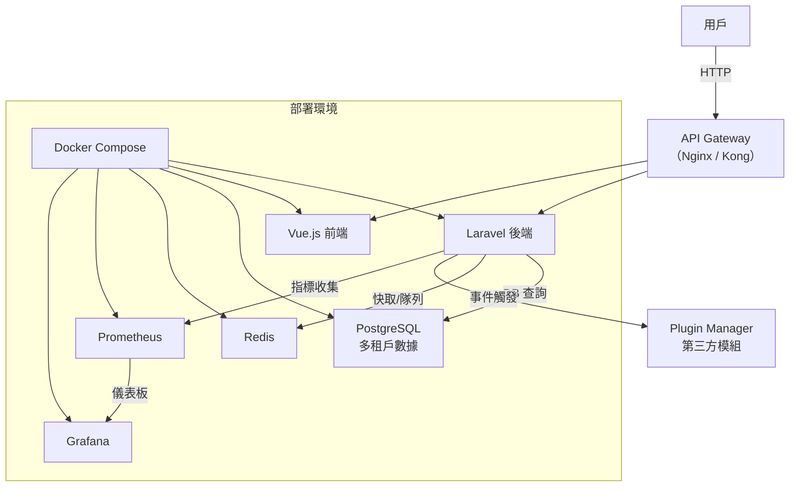

# ECommerceTenancy - 多租戶電商與餐飲科技平台

**ECommerceTenancy** 是一個模組化的多租戶平台原型，專為電商與餐飲科技應用設計，展示 Laravel 與 Vue.js 的全端開發能力。專案支援多租戶數據隔離、線上訂單處理、模組化擴展與監控整合，適用於餐飲業的線上點餐、金流支付、促銷推薦等場景。程式碼結構清晰，適合開發者參考與快速部署。

## 專案亮點
- **多租戶架構**：採用 row-based 數據隔離，支援子域名（如 `tenanta.localhost`）動態解析，適用於多餐廳或連鎖品牌管理。
- **模組化設計**：獨立封裝租戶、商品、訂單與支付模組，支援插件系統，易於整合線上點餐或金流服務。
- **本地化與數位行銷**：前端使用 vue-i18n 支援多語系（繁中、英文），後端動態處理貨幣格式，助力品牌國際化推廣。
- **簡易推薦模組**：基於訂單熱門度的商品推薦，模擬餐廳促銷（如熱門餐點推薦），展示 AI 應用潛力。
- **監控整合**：使用 Prometheus 與 Grafana 監控 API 流量與訂單指標，確保餐飲平台穩定性。
- **高品質程式碼**：包含 PHPUnit 測試、OpenAPI 文件與 GitHub Actions CI/CD，符合現代開發標準。

## 應用場景
- **餐飲科技**：支援多餐廳線上點餐系統，透過多租戶架構為每個餐廳提供獨立數據管理，整合金流（如 ECPay）與叫號系統。
- **數位行銷**：推薦模組可推廣熱門餐點或促銷活動，前端多語系支援品牌國際化，後端數據分析助力行銷策略優化。
- **地方產業**：模組化設計可快速適配地方商圈需求，如美食街或校園餐廳的數位化轉型。

## 技術棧
- **後端**：Laravel 10.x、PostgreSQL、Redis
- **前端**：Vue 3、Tailwind CSS、vue-i18n
- **監控**：Prometheus、Grafana
- **部署**：Docker、Docker Compose、GitHub Actions

## 系統架構圖
以下為專案架構圖，使用 Mermaid 繪製，展示模組交互與部署方式：



## 安裝與部署

本專案僅包含核心程式碼，需自行安裝依賴並部署環境。以下為完整步驟：

### 環境需求
- Docker 與 Docker Compose
- PHP 8.3
- Node.js 20
- Composer
- npm

### 安裝步驟
1. **克隆專案**：
   ```bash
   git clone https://github.com/BpsEason/ECommerceTenancy.git
   cd ECommerceTenancy
   ```

2. **設置後端依賴**：
   - 複製環境檔案：
     ```bash
     cp backend/.env.example backend/.env
     ```
   - 安裝 Composer 依賴：
     ```bash
     cd backend
     composer install
     php artisan key:generate
     ```
   - 執行遷移與資料填充：
     ```bash
     php artisan migrate
     php artisan db:seed --class=TenantSeeder
     ```

3. **設置前端依賴**：
   - 在 `frontend` 目錄下，創建 `package.json`：
     ```json
     {
       "name": "ecommerce-tenancy-frontend",
       "version": "1.0.0",
       "scripts": {
         "dev": "vite",
         "build": "vite build",
         "serve": "vite preview"
       },
       "dependencies": {
         "axios": "^1.6.0",
         "vue": "^3.3.0",
         "vue-i18n": "^9.2.0",
         "tailwindcss": "^3.3.0",
         "vite": "^4.4.0"
       }
     }
     ```
   - 安裝依賴並構建：
     ```bash
     cd frontend
     npm install
     npm run build
     ```

4. **啟動 Docker 環境**：
   - 在專案根目錄執行：
     ```bash
     docker-compose up -d --build
     ```
   - 服務端口：
     - Laravel 後端：`http://localhost:8000`
     - Vue.js 前端：`http://localhost:3000`
     - Prometheus：`http://localhost:9090`
     - Grafana：`http://localhost:3001`（預設帳密：admin/admin）
     - 測試租戶：`http://tenanta.localhost:8000/api/v1/products`

5. **配置本地測試域名**：
   - 編輯本地 hosts 檔案（`/etc/hosts` 或 `C:\Windows\System32\drivers\etc\hosts`）：
     ```
     127.0.0.1 tenanta.localhost
     127.0.0.1 tenantb.localhost
     ```

6. **訪問與測試**：
   - 訪問 `http://localhost:3000` 查看前端介面（支援中英文切換）。
   - 透過 `http://tenanta.localhost:8000/api/v1/products` 獲取租戶商品。
   - 檢查 `http://localhost:9090`（Prometheus）與 `http://localhost:3001`（Grafana）查看監控數據。

## 常見問題與解答

以下針對餐飲科技與數位行銷相關問題，提供技術解答，幫助開發者理解專案設計：

### 問題 1：多租戶架構如何設計？為何選擇 row-based 隔離？
**解答**：
- **設計**：透過 `SetTenantFromDomain` 中間件解析子域名（如 `tenanta.localhost`），從資料庫查詢租戶並將 `tenant_id` 注入請求，實現動態租戶上下文。
- **實現**：在 `Product` 和 `Order` 模型中使用 Laravel Global Scope，自動為查詢添加 `tenant_id` 過濾，確保餐廳數據隔離，簡化開發流程。
- **優點**：
  - 靈活：單一資料庫支援多餐廳數據管理，便於聚合分析（如跨餐廳銷售報表）。
  - 成本低：無需為每家餐廳創建獨立資料庫，適合快速部署。
  - 應用場景：適用於餐飲連鎖或美食街的數位化平台，快速支援新租戶。
- **為何選擇 row-based**：適合餐飲科技的中小規模應用，快速迭代並降低運維成本。
- **未來規劃**：可升級至 schema-based 隔離（獨立 schema），提升數據安全性，適合高階餐飲品牌。

### 問題 2：如何實現模組化與可擴展性？
**解答**：
- **Plugin Manager**：`PluginManager` 服務實現事件驅動設計，支援動態插件註冊。例如，`OrderController` 在訂單創建後呼叫 `executeHook('order.created', ...)`，觸發促銷或通知。
- **餐飲應用**：可整合叫號系統或第三方金流插件（如 ECPay），無需修改核心程式碼，適合快速適配餐廳需求。
- **價值**：解耦業務邏輯與外部功能（如 LINE 通知、ERP 同步），提升可維護性與擴展性。

### 問題 3：推薦模組的邏輯是什麼？如何改進以支援餐飲促銷？
**解答**：
- **當前邏輯**：`RecommendationController` 基於訂單銷量（`SUM(order_items.quantity)`）推薦熱門商品，模擬餐廳促銷場景（如推薦熱門餐點）。
- **優點**：簡單高效，無需外部服務，適合餐飲平台原型。
- **改進方案**：
  - **數據來源**：納入顧客行為數據（點擊、收藏），提供個人化餐點推薦。
  - **演算法**：採用關聯規則，分析「點 A 餐點常搭配 B 餐點」的模式，優化套餐推廣。
  - **技術整合**：使用 FastAPI 與機器學習（如 Scikit-learn）訓練模型，透過 API 提供推薦，支援點點全球的數位行銷需求。

### 問題 4：為何在 `RecordMetrics.php` 中使用 Redis 作為 Prometheus 儲存後端？
**解答**：
- **作用**：`RecordMetrics` 中間件收集 API 請求指標（如訂單 API 流量），供 Prometheus 抓取，支援餐飲平台監控。
- **Redis 的必要性**：
  - **共享數據**：多 PHP-FPM worker 需共享指標，Redis 確保數據一致性。
  - **原子操作**：Redis 的 `INCR` 避免併發競爭，保證指標準確。
- **餐飲應用**：監控線上點餐流量與系統性能，幫助餐廳優化運營效率。

### 問題 5：為何使用 Docker 與 Docker Compose？
**解答**：
- **環境一致性**：Docker 確保開發、測試與生產環境一致，避免餐飲平台部署問題。
- **依賴隔離**：後端、前端、資料庫與 Redis 獨立運行，支援多餐廳服務整合。
- **部署簡化**：Docker Compose 一鍵部署，適合快速上線餐飲科技平台。
- **監控優勢**：Prometheus/Grafana 提供訂單與系統指標，助力餐廳運維。

### 問題 6：Schema-based 多租戶與當前設計有何不同？
**解答**：
- **Schema-based**：為每家餐廳創建獨立 schema，數據完全隔離。
- **對比**：
  - **優點**：更高安全性，適合高階餐飲品牌；便於單餐廳數據備份。
  - **缺點**：管理成本高，跨餐廳分析較複雜。
- **當前 row-based**：單一 schema 透過 `tenant_id` 隔離，適合中小餐廳快速部署。
- **應用場景**：Schema-based 適用於大型連鎖品牌，row-based 適合美食街或校園餐廳。

### 問題 7：如何確保程式碼品質？
**解答**：
- **規範**：遵循 Laravel 最佳實踐與 PSR-12，確保程式碼一致性。
- **測試**：撰寫 PHPUnit 測試，驗證租戶隔離與訂單邏輯，保障餐飲功能穩定。
- **CI/CD**：GitHub Actions 自動運行測試，確保新程式碼不影響點餐系統。
- **文件**：提供 OpenAPI 文件與註解，方便餐飲科技團隊維護。

## 關鍵程式碼片段

以下為核心程式碼，展示多租戶、模組化與監控實現，適用於餐飲科技場景：

### 1. 多租戶中間件（`SetTenantFromDomain.php`）
解析子域名，支援多餐廳數據隔離。

```php
<?php
namespace App\Http\Middleware;

use Closure;
use Illuminate\Http\Request;
use Symfony\Component\HttpFoundation\Response;
use App\Models\Tenant;

class SetTenantFromDomain
{
    public function handle(Request $request, Closure $next): Response
    {
        // 解析子域名（如 restaurant1.localhost）
        $host = $request->getHost();
        $subdomain = explode('.', $host)[0];
        
        // 查詢餐廳租戶並注入 tenant_id
        $tenant = Tenant::where('domain', $subdomain)->first();
        if ($tenant) {
            $request->attributes->add(['tenant_id' => $tenant->id]);
            \Log::info('Tenant set for request: ' . $subdomain);
        } else {
            \Log::warning('No tenant found for domain: ' . $subdomain);
        }
        
        return $next($request);
    }
}
```

### 2. 商品模型（`Product.php`）
自動過濾餐廳商品數據。

```php
<?php
namespace App\Models;

use Illuminate\Database\Eloquent\Factories\HasFactory;
use Illuminate\Database\Eloquent\Model;
use Illuminate\Database\Eloquent\Builder;

class Product extends Model
{
    use HasFactory;

    protected $fillable = [
        'tenant_id',
        'name',
        'description',
        'price',
    ];

    protected static function booted()
    {
        // 自動為查詢添加餐廳 tenant_id 過濾
        static::addGlobalScope('tenant_id', function (Builder $builder) {
            if ($tenantId = request()->attributes->get('tenant_id')) {
                $builder->where('tenant_id', $tenantId);
            }
        });
    }
}
```

### 3. 推薦控制器（`RecommendationController.php`）
模擬餐廳熱門餐點推薦。

```php
<?php
namespace App\Http\Controllers;

use App\Models\Product;
use Illuminate\Http\Request;

class RecommendationController extends Controller
{
    public function index(Request $request)
    {
        // 檢查餐廳租戶上下文
        $tenantId = $request->attributes->get('tenant_id');
        if (!$tenantId) {
            return response()->json(['error' => 'Tenant context not found.'], 404);
        }
        
        // 推薦熱門餐點（基於銷量）
        $popularProducts = Product::where('tenant_id', $tenantId)
            ->join('order_items', 'products.id', '=', 'order_items.product_id')
            ->select('products.*', \DB::raw('SUM(order_items.quantity) as total_sold'))
            ->groupBy('products.id', 'products.tenant_id', 'products.name', 'products.description', 'products.price', 'products.created_at', 'products.updated_at')
            ->orderByRaw('SUM(order_items.quantity) DESC')
            ->take(3)
            ->get();
            
        return response()->json($popularProducts);
    }
}
```

### 4. 插件管理器（`PluginManager.php`）
支援餐飲插件（如叫號系統、金流）。

```php
<?php
namespace App\Services;

use Illuminate\Support\Facades\Log;

class PluginManager
{
    protected array $plugins = [];

    public function registerPlugin(string $pluginName, array $config)
    {
        // 註冊插件（如叫號系統）
        $this->plugins[$pluginName] = $config;
        Log::info("Plugin '{$pluginName}' registered with config: " . json_encode($config));
    }

    public function executeHook(string $hook, array $data)
    {
        // 執行插件鉤子（如訂單完成後發送通知）
        Log::info("Executing hook '{$hook}' with data: " . json_encode($data));
        foreach ($this->plugins as $pluginName => $config) {
            Log::info("  -> Hook '{$hook}' triggered for plugin '{$pluginName}'");
        }
    }
}
```

### 5. Prometheus 監控中間件（`RecordMetrics.php`）
監控點餐 API 流量。

```php
<?php
namespace App\Http\Middleware;

use Closure;
use Illuminate\Http\Request;
use Prometheus\CollectorRegistry;
use Prometheus\Storage\Redis;
use Symfony\Component\HttpFoundation\Response;

class RecordMetrics
{
    public function handle(Request $request, Closure $next): Response
    {
        $response = $next($request);

        try {
            // 使用 Redis 儲存監控指標
            $registry = CollectorRegistry::getInstance(new Redis(['host' => env('REDIS_HOST', 'redis')]));

            // 記錄點餐 API 請求
            $counter = $registry->getOrRegisterCounter(
                'ecommerce_platform',
                'http_requests_total',
                'Total HTTP requests to the application',
                ['method', 'endpoint', 'status_code']
            );
            $counter->inc([$request->method(), $request->path(), (string) $response->getStatusCode()]);
        } catch (\Throwable $e) {
            \Log::error('Prometheus metric recording failed: ' . $e->getMessage());
        }

        return $response;
    }
}
```

## API 文件
位於 `docs/api.yaml`，採用 OpenAPI 3.0，涵蓋租戶、商品、訂單、支付與推薦 API，支援餐飲平台開發。

## 測試覆蓋
包含 PHPUnit 測試，驗證餐廳數據隔離與訂單邏輯：
- `ProductControllerTest.php`：測試餐廳商品隔離。
- `OrderControllerTest.php`：測試點餐流程。
- 執行測試：
  ```bash
  cd backend
  vendor/bin/phpunit
  ```

## 未來改進
- 整合 ECPay 等金流，支援餐飲支付。
- 開發叫號系統 API，優化餐廳運營。
- 使用 FastAPI 與機器學習，實現顧客行為分析與個人化推薦。
- 支援 schema-based 多租戶，提升大型連鎖餐廳安全性。

## 注意事項
- 需自行安裝依賴與配置子域名（如 `restaurant1.localhost`）。
- Grafana 儀表板需額外配置以展示監控效果。

## 授權
MIT
