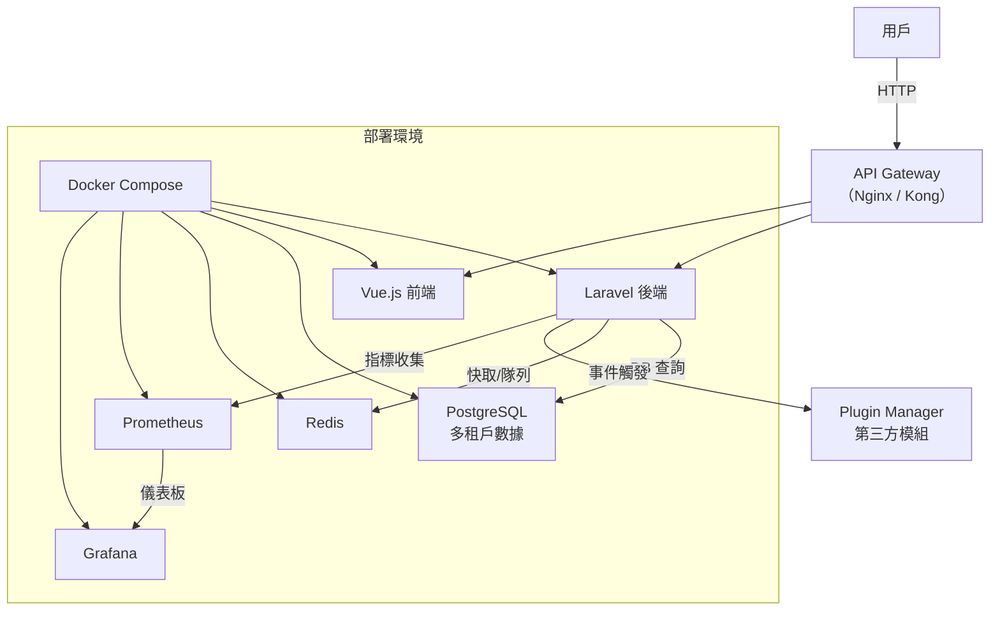

# ECommerceTenancy - 多租戶電商平台

**ECommerceTenancy** 是一個模組化的多租戶電商平台原型，專注於展示 Laravel 與 Vue.js 的全端開發能力，以及多租戶架構、監控整合與插件系統的設計。專案結構清晰，程式碼簡潔，適合快速部署與審閱，旨在提供一個高品質的技術展示範例。

## 專案亮點
- **多租戶架構**：基於 row-based 數據隔離，透過子域名動態解析租戶，確保數據安全與靈活性。
- **模組化設計**：租戶管理、商品、訂單與支付模組獨立封裝，支援插件系統，易於擴展。
- **本地化支援**：前端整合 vue-i18n（繁中、英文），後端動態格式化貨幣，適應地區需求。
- **簡易推薦模組**：模擬基於訂單熱門度的商品推薦，展示對 AI 功能的理解。
- **監控與穩定性**：整合 Prometheus 與 Grafana，監控 API 請求與業務指標，提供運維洞察。
- **高品質程式碼**：包含 PHPUnit 測試、OpenAPI 文件與 GitHub Actions CI/CD，符合現代開發流程。

## 技術棧
- **後端**：Laravel 10.x、PostgreSQL、Redis
- **前端**：Vue 3、Tailwind CSS、vue-i18n
- **監控**：Prometheus、Grafana
- **部署**：Docker、Docker Compose、GitHub Actions

## 系統架構圖
以下為專案架構圖，使用 Mermaid 繪製，展示模組間的交互與部署方式：



## 安裝與部署

本專案僅包含核心程式碼，需自行安裝依賴並部署環境。以下為完整步驟，確保開發者能快速運行專案。

### 環境需求
- Docker 與 Docker Compose
- PHP 8.3（後端）
- Node.js 20（前端）
- Composer（PHP 依賴管理）
- npm（前端依賴管理）

### 安裝步驟
1. **克隆專案**：
   ```bash
   git clone https://github.com/your-username/ECommerceTenancy.git
   cd ECommerceTenancy
   ```

2. **設置後端依賴**：
   - 複製環境檔案：
     ```bash
     cp backend/.env.example backend/.env
     ```
   - 安裝 Composer 依賴：
     ```bash
     cd backend
     composer install
     php artisan key:generate
     ```
   - 執行遷移與資料填充：
     ```bash
     php artisan migrate
     php artisan db:seed --class=TenantSeeder
     ```

3. **設置前端依賴**：
   - 在 `frontend` 目錄下，創建 `package.json`：
     ```json
     {
       "name": "ecommerce-tenancy-frontend",
       "version": "1.0.0",
       "scripts": {
         "dev": "vite",
         "build": "vite build",
         "serve": "vite preview"
       },
       "dependencies": {
         "axios": "^1.6.0",
         "vue": "^3.3.0",
         "vue-i18n": "^9.2.0",
         "tailwindcss": "^3.3.0",
         "vite": "^4.4.0"
       }
     }
     ```
   - 安裝依賴並構建：
     ```bash
     cd frontend
     npm install
     npm run build
     ```

4. **啟動 Docker 環境**：
   - 在專案根目錄執行：
     ```bash
     docker-compose up -d --build
     ```
   - 服務端口：
     - Laravel 後端：`http://localhost:8000`
     - Vue.js 前端：`http://localhost:3000`
     - Prometheus：`http://localhost:9090`
     - Grafana：`http://localhost:3001`（預設帳密：admin/admin）
     - 測試租戶：`http://tenanta.localhost:8000/api/v1/products`

5. **配置本地測試域名**：
   - 編輯本地 hosts 檔案（`/etc/hosts` 或 `C:\Windows\System32\drivers\etc\hosts`）：
     ```
     127.0.0.1 tenanta.localhost
     127.0.0.1 tenantb.localhost
     ```

6. **訪問與測試**：
   - 打開 `http://localhost:3000` 查看前端介面（支援中英文切換）。
   - 透過 `http://tenanta.localhost:8000/api/v1/products` 獲取租戶商品。
   - 訪問 `http://localhost:9090` 查看 Prometheus 指標，`http://localhost:3001` 查看 Grafana 儀表板。

## 關鍵程式碼片段

以下為專案核心程式碼，展示多租戶、模組化與監控的實現，附上詳細註解以方便其他開發者理解：

### 1. 多租戶中間件（`SetTenantFromDomain.php`）
透過子域名解析租戶，將租戶 ID 注入請求上下文，實現數據隔離。

```php
<?php
namespace App\Http\Middleware;

use Closure;
use Illuminate\Http\Request;
use Symfony\Component\HttpFoundation\Response;
use App\Models\Tenant;

class SetTenantFromDomain
{
    public function handle(Request $request, Closure $next): Response
    {
        // 解析請求主機名稱，提取子域名（例如 tenanta.localhost）
        $host = $request->getHost();
        $subdomain = explode('.', $host)[0];
        
        // 根據子域名查詢租戶記錄
        $tenant = Tenant::where('domain', $subdomain)->first();
        
        if ($tenant) {
            // 將租戶 ID 存入請求屬性，供後續模組使用
            $request->attributes->add(['tenant_id' => $tenant->id]);
            \Log::info('Tenant set for request: ' . $subdomain);
        } else {
            // 未找到租戶時記錄警告，確保日誌可追溯
            \Log::warning('No tenant found for domain: ' . $subdomain);
        }
        
        return $next($request);
    }
}
```

### 2. 商品模型（`Product.php`）
使用全域 Scope 自動過濾租戶數據，確保隔離性。

```php
<?php
namespace App\Models;

use Illuminate\Database\Eloquent\Factories\HasFactory;
use Illuminate\Database\Eloquent\Model;
use Illuminate\Database\Eloquent\Builder;

class Product extends Model
{
    use HasFactory;

    protected $fillable = [
        'tenant_id',
        'name',
        'description',
        'price',
    ];

    protected static function booted()
    {
        // 全域 Scope 確保查詢僅返回當前租戶的數據
        static::addGlobalScope('tenant_id', function (Builder $builder) {
            if ($tenantId = request()->attributes->get('tenant_id')) {
                $builder->where('tenant_id', $tenantId);
            }
        });
    }
}
```

### 3. 推薦控制器（`RecommendationController.php`）
模擬基於訂單熱門度的推薦邏輯，展示對 AI 模組的設計能力。

```php
<?php
namespace App\Http\Controllers;

use App\Models\Product;
use Illuminate\Http\Request;

class RecommendationController extends Controller
{
    public function index(Request $request)
    {
        // 檢查租戶上下文
        $tenantId = $request->attributes->get('tenant_id');
        if (!$tenantId) {
            return response()->json(['error' => 'Tenant context not found.'], 404);
        }
        
        // 模擬協同過濾：根據訂單商品銷量排序，選取前三名
        $popularProducts = Product::where('tenant_id', $tenantId)
            ->join('order_items', 'products.id', '=', 'order_items.product_id')
            ->select('products.*', \DB::raw('SUM(order_items.quantity) as total_sold'))
            ->groupBy('products.id', 'products.tenant_id', 'products.name', 'products.description', 'products.price', 'products.created_at', 'products.updated_at')
            ->orderByRaw('SUM(order_items.quantity) DESC')
            ->take(3)
            ->get();
            
        return response()->json($popularProducts);
    }
}
```

### 4. 插件管理器（`PluginManager.php`）
實現模組化設計，支援第三方插件動態掛載。

```php
<?php
namespace App\Services;

use Illuminate\Support\Facades\Log;

class PluginManager
{
    protected array $plugins = [];

    public function registerPlugin(string $pluginName, array $config)
    {
        // 註冊插件並儲存其配置
        $this->plugins[$pluginName] = $config;
        Log::info("Plugin '{$pluginName}' registered with config: " . json_encode($config));
    }

    public function executeHook(string $hook, array $data)
    {
        // 執行指定鉤子，模擬第三方模組的事件處理
        Log::info("Executing hook '{$hook}' with data: " . json_encode($data));
        foreach ($this->plugins as $pluginName => $config) {
            Log::info("  -> Hook '{$hook}' triggered for plugin '{$pluginName}'");
        }
    }
}
```

### 5. Prometheus 監控中間件（`RecordMetrics.php`）
收集 API 請求指標，展示 DevOps 整合能力。

```php
<?php
namespace App\Http\Middleware;use Closure;
use Illuminate\Http\Request;
use Prometheus\CollectorRegistry;
use Prometheus\Storage\Redis;
use Symfony\Component\HttpFoundation\Response;

class RecordMetrics
{
    public function handle(Request $request, Closure $next): Response
    {
        $response = $next($request);

        try {
            // 使用 Redis 作為 Prometheus 儲存後端
            $registry = CollectorRegistry::getInstance(new Redis(['host' => env('REDIS_HOST', 'redis')]));

            // 記錄 HTTP 請求計數，包含方法、路徑與狀態碼
            $counter = $registry->getOrRegisterCounter(
                'ecommerce_platform',
                'http_requests_total',
                'Total HTTP requests to the application',
                ['method', 'endpoint', 'status_code']
            );
            $counter->inc([$request->method(), $request->path(), (string) $response->getStatusCode()]);
        } catch (\Throwable $e) {
            // 記錄監控失敗日誌，確保系統穩定性
            \Log::error('Prometheus metric recording failed: ' . $e->getMessage());
        }

        return $response;
    }
}
```

## API 文件
API 文件採用 OpenAPI 3.0 規範，位於 `docs/api.yaml`，涵蓋租戶管理、商品、訂單、支付與推薦 API。開發者可使用 Swagger UI 導入查看。

## 測試覆蓋
專案包含 PHPUnit 測試，涵蓋商品與訂單模組：
- `ProductControllerTest.php`：驗證租戶商品隔離邏輯。
- `OrderControllerTest.php`：測試訂單創建與數據一致性。
- 執行測試：
  ```bash
  cd backend
  vendor/bin/phpunit
  ```
- 測試覆蓋率報告可透過 GitHub Actions 查看。

## 未來改進
- 支援 schema-based 多租戶，提升數據隔離強度。
- 整合 FastAPI 實現進階 AI 推薦模組。
- 擴展支付模組，支援 Stripe、ECPay 等金流。
- 完善插件系統，支援 POS 與 IoT 設備整合。

## 注意事項
- 專案僅提供核心程式碼，需自行安裝 Composer 與 npm 依賴。
- 本地測試需配置 `tenanta.localhost` 等子域名至 hosts 檔案。
- Prometheus 與 Grafana 的儀表板需額外配置以展示完整監控效果。

## 授權
MIT
