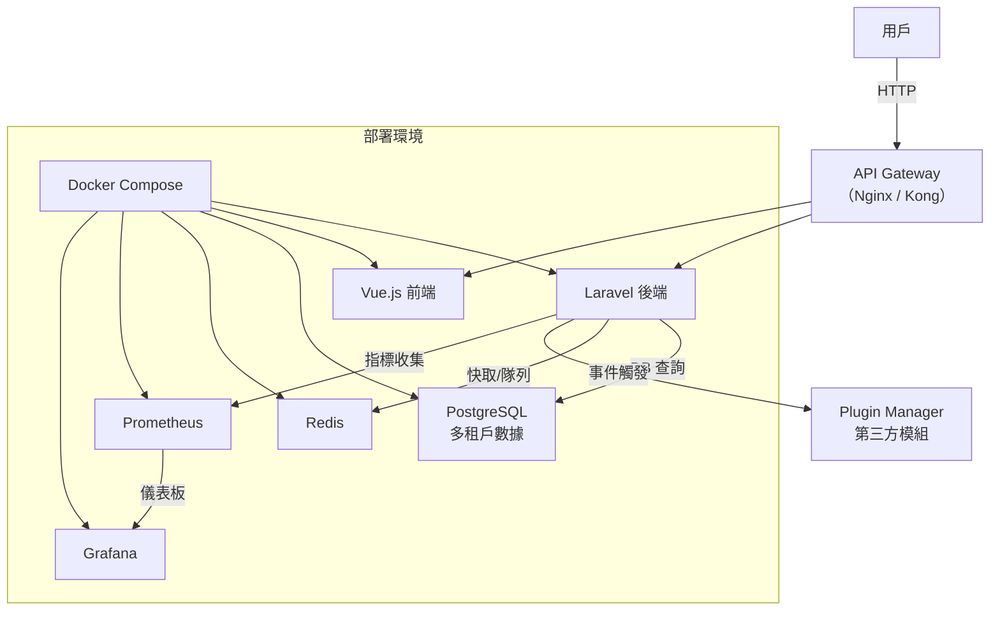

# ECommerceTenancy - 多租戶電商平台

**ECommerceTenancy** 是一個模組化的多租戶電商平台原型，專注於展示 Laravel 與 Vue.js 的全端開發能力，涵蓋多租戶架構、本地化支援、簡易推薦模組與監控整合。程式碼結構清晰，適合快速部署與審閱，旨在提供一個實用的技術展示範例，方便其他開發者參考與學習。

## 專案亮點
- **多租戶架構**：採用 row-based 數據隔離，透過子域名動態解析租戶，確保數據安全。
- **模組化設計**：核心模組（租戶、商品、訂單、支付）獨立封裝，支援插件系統，易於擴展。
- **本地化支援**：前端整合 vue-i18n（繁中、英文），後端動態處理貨幣格式。
- **簡易推薦模組**：基於訂單熱門度的商品推薦，展示 AI 模組的設計思路。
- **監控整合**：使用 Prometheus 與 Grafana 監控 API 請求與業務指標。
- **高品質程式碼**：包含 PHPUnit 測試、OpenAPI 文件與 GitHub Actions CI/CD。

## 技術棧
- **後端**：Laravel 10.x、PostgreSQL、Redis
- **前端**：Vue 3、Tailwind CSS、vue-i18n
- **監控**：Prometheus、Grafana
- **部署**：Docker、Docker Compose、GitHub Actions

## 系統架構圖
以下為專案架構圖，使用 Mermaid 繪製，展示模組交互與部署方式：



## 安裝與部署

本專案僅包含核心程式碼，需自行安裝依賴並部署環境。以下為完整步驟，幫助開發者快速運行專案。

### 環境需求
- Docker 與 Docker Compose
- PHP 8.3
- Node.js 20
- Composer
- npm

### 安裝步驟
1. **克隆專案**：
   ```bash
   git clone https://github.com/your-username/ECommerceTenancy.git
   cd ECommerceTenancy
   ```

2. **設置後端依賴**：
   - 複製環境檔案：
     ```bash
     cp backend/.env.example backend/.env
     ```
   - 安裝 Composer 依賴：
     ```bash
     cd backend
     composer install
     php artisan key:generate
     ```
   - 執行遷移與資料填充：
     ```bash
     php artisan migrate
     php artisan db:seed --class=TenantSeeder
     ```

3. **設置前端依賴**：
   - 在 `frontend` 目錄下，創建 `package.json`：
     ```json
     {
       "name": "ecommerce-tenancy-frontend",
       "version": "1.0.0",
       "scripts": {
         "dev": "vite",
         "build": "vite build",
         "serve": "vite preview"
       },
       "dependencies": {
         "axios": "^1.6.0",
         "vue": "^3.3.0",
         "vue-i18n": "^9.2.0",
         "tailwindcss": "^3.3.0",
         "vite": "^4.4.0"
       }
     }
     ```
   - 安裝依賴並構建：
     ```bash
     cd frontend
     npm install
     npm run build
     ```

4. **啟動 Docker 環境**：
   - 在專案根目錄執行：
     ```bash
     docker-compose up -d --build
     ```
   - 服務端口：
     - Laravel 後端：`http://localhost:8000`
     - Vue.js 前端：`http://localhost:3000`
     - Prometheus：`http://localhost:9090`
     - Grafana：`http://localhost:3001`（預設帳密：admin/admin）
     - 測試租戶：`http://tenanta.localhost:8000/api/v1/products`

5. **配置本地測試域名**：
   - 編輯本地 hosts 檔案（`/etc/hosts` 或 `C:\Windows\System32\drivers\etc\hosts`）：
     ```
     127.0.0.1 tenanta.localhost
     127.0.0.1 tenantb.localhost
     ```

6. **訪問與測試**：
   - 訪問 `http://localhost:3000` 查看前端介面（支援中英文切換）。
   - 透過 `http://tenanta.localhost:8000/api/v1/products` 獲取租戶商品。
   - 檢查 `http://localhost:9090`（Prometheus）與 `http://localhost:3001`（Grafana）查看監控數據。

## 常見問題與解答

以下回答常見的技術問題，幫助開發者理解專案設計與實現細節：

### 問題 1：多租戶架構如何設計？為何選擇 row-based 隔離？
**解答**：
- **設計**：多租戶架構透過 `SetTenantFromDomain` 中間件實現，解析請求的子域名（如 `tenanta.localhost`），從資料庫查詢對應租戶並將 `tenant_id` 注入請求屬性。
- **實現**：在 `Product` 和 `Order` 模型中使用 Laravel 的 Global Scope，自動為查詢添加 `tenant_id` 過濾條件，確保數據隔離，無需在每個查詢手動指定。
- **優點**：
  - 靈活：所有租戶數據存於同一資料庫，方便跨租戶分析與管理。
  - 成本低：無需為每個租戶創建獨立資料庫，降低維護成本。
  - 部署簡單：共用同一程式碼與資料庫實例，適合快速迭代。
- **為何選擇 row-based**：適合原型或中小規模 SaaS 應用，租戶數量多但數據量不大時，row-based 提供高效的開發與部署體驗。
- **未來規劃**：可升級至 schema-based 隔離（每個租戶獨立 schema），提供更高數據隔離性，適用於高安全性需求的場景。

### 問題 2：如何實現模組化與可擴展性？
**解答**：
- **Plugin Manager**：透過 `PluginManager` 服務實現事件驅動的模組化設計，支援動態註冊與執行插件。例如，`OrderController` 在創建訂單後呼叫 `executeHook('order.created', ...)`，觸發外部事件。
- **價值**：將核心業務邏輯（如訂單處理）與外部功能（如通知、ERP 同步）解耦，未來可新增插件（如促銷模組）而無需修改核心程式碼，提升可維護性與擴展性。
- **範例**：訂單創建後，插件可發送 LINE 通知或同步至第三方系統，無需更改 `OrderController`。

### 問題 3：簡易推薦模組的邏輯是什麼？如何改進？
**解答**：
- **當前邏輯**：`RecommendationController` 模擬簡單的協同過濾，透過 SQL 查詢計算訂單中銷量最高的 3 個商品（`SUM(order_items.quantity)`）。
- **優點**：實現簡單，無需外部服務，適合原型展示，快速提供推薦結果。
- **改進方案**：
  - **數據來源**：擴展至使用者行為數據（瀏覽、點擊、收藏），提供更精準的推薦。
  - **演算法**：引入關聯規則（Association Rules），分析「購買 A 也常購買 B」的模式。
  - **技術整合**：使用 FastAPI 與機器學習庫（如 Scikit-learn 或 TensorFlow）訓練模型，透過 API 提供推薦服務，與 Laravel 後端無縫整合。

### 問題 4：為何在 `RecordMetrics.php` 中使用 Redis 作為 Prometheus 儲存後端？
**解答**：
- **作用**：`RecordMetrics` 中間件收集 API 請求指標（如方法、路徑、狀態碼），供 Prometheus 定期抓取。
- **Redis 的必要性**：
  - **共享數據**：Laravel 使用多個 PHP-FPM worker 處理請求，若無共享儲存，每個 worker 的計數器獨立，導致數據不一致。Redis 提供集中儲存，確保指標準確。
  - **原子操作**：Redis 的 `INCR` 等原子操作避免併發請求的競爭條件，保證計數器數據正確。
- **總結**：Redis 與 Prometheus 結合是分佈式系統監控的標準做法，確保指標在多進程環境下的一致性與可靠性。

### 問題 5：為何使用 Docker 與 Docker Compose？
**解答**：
- **環境一致性**：Docker 將應用及其依賴打包，確保開發、測試與生產環境一致，避免「在我電腦上可以跑」的問題。
- **依賴隔離**：後端、前端、資料庫與 Redis 運行於獨立容器，防止版本衝突。
- **部署簡化**：Docker Compose 透過單一 YAML 文件定義所有服務，一鍵啟動（`docker-compose up`），降低部署複雜度。
- **運維便利**：整合 Prometheus 與 Grafana，監控容器性能與業務指標，提供可視化運維洞察。

### 問題 6：Schema-based 多租戶與當前設計有何不同？
**解答**：
- **Schema-based 設計**：為每個租戶創建獨立的資料庫 schema（PostgreSQL）或獨立資料庫，數據完全隔離。
- **對比**：
  - **優點**：更高隔離性（租戶數據分處不同命名空間），便於單租戶備份與恢復，適合高安全性場景。
  - **缺點**：管理成本高（需維護多 schema），跨租戶分析較複雜。
- **當前 row-based**：所有租戶數據存於同一 schema，透過 `tenant_id` 隔離，適合快速開發與中小規模應用。
- **總結**：Schema-based 適合高安全性需求，row-based 則更靈活與經濟，選擇依據應用場景而定。

### 問題 7：如何確保程式碼品質？
**解答**：
- **程式碼規範**：遵循 Laravel 最佳實踐與 PSR-12 規範，保持一致的命名與結構。
- **自動化測試**：撰寫 PHPUnit 測試（`ProductControllerTest`、`OrderControllerTest`），驗證租戶隔離與訂單邏輯，確保功能穩定。
- **CI/CD**：配置 GitHub Actions，自動運行測試與程式碼檢查，防止新程式碼引入錯誤。
- **文件化**：提供 OpenAPI 文件（`docs/api.yaml`）與詳細註解，方便其他開發者理解與維護。

## 關鍵程式碼片段

以下為核心程式碼，附上註解，展示多租戶、模組化與監控的實現：

### 1. 多租戶中間件（`SetTenantFromDomain.php`）
解析子域名並注入租戶上下文，實現數據隔離。

```php
<?php
namespace App\Http\Middleware;

use Closure;
use Illuminate\Http\Request;
use Symfony\Component\HttpFoundation\Response;
use App\Models\Tenant;

class SetTenantFromDomain
{
    public function handle(Request $request, Closure $next): Response
    {
        // 解析主機名稱，提取子域名
        $host = $request->getHost();
        $subdomain = explode('.', $host)[0];
        
        // 查詢租戶並注入 tenant_id
        $tenant = Tenant::where('domain', $subdomain)->first();
        if ($tenant) {
            $request->attributes->add(['tenant_id' => $tenant->id]);
            \Log::info('Tenant set for request: ' . $subdomain);
        } else {
            \Log::warning('No tenant found for domain: ' . $subdomain);
        }
        
        return $next($request);
    }
}
```

### 2. 商品模型（`Product.php`）
使用全域 Scope 確保租戶數據隔離。

```php
<?php
namespace App\Models;

use Illuminate\Database\Eloquent\Factories\HasFactory;
use Illuminate\Database\Eloquent\Model;
use Illuminate\Database\Eloquent\Builder;

class Product extends Model
{
    use HasFactory;

    protected $fillable = [
        'tenant_id',
        'name',
        'description',
        'price',
    ];

    protected static function booted()
    {
        // 自動為查詢添加 tenant_id 過濾
        static::addGlobalScope('tenant_id', function (Builder $builder) {
            if ($tenantId = request()->attributes->get('tenant_id')) {
                $builder->where('tenant_id', $tenantId);
            }
        });
    }
}
```

### 3. 推薦控制器（`RecommendationController.php`）
模擬基於銷量的推薦邏輯。

```php
<?php
namespace App\Http\Controllers;

use App\Models\Product;
use Illuminate\Http\Request;

class RecommendationController extends Controller
{
    public function index(Request $request)
    {
        // 檢查租戶上下文
        $tenantId = $request->attributes->get('tenant_id');
        if (!$tenantId) {
            return response()->json(['error' => 'Tenant context not found.'], 404);
        }
        
        // 根據訂單銷量排序，選取前三商品
        $popularProducts = Product::where('tenant_id', $tenantId)
            ->join('order_items', 'products.id', '=', 'order_items.product_id')
            ->select('products.*', \DB::raw('SUM(order_items.quantity) as total_sold'))
            ->groupBy('products.id', 'products.tenant_id', 'products.name', 'products.description', 'products.price', 'products.created_at', 'products.updated_at')
            ->orderByRaw('SUM(order_items.quantity) DESC')
            ->take(3)
            ->get();
            
        return response()->json($popularProducts);
    }
}
```

### 4. 插件管理器（`PluginManager.php`）
支援動態插件擴展。

```php
<?php
namespace App\Services;

use Illuminate\Support\Facades\Log;

class PluginManager
{
    protected array $plugins = [];

    public function registerPlugin(string $pluginName, array $config)
    {
        // 註冊插件並記錄配置
        $this->plugins[$pluginName] = $config;
        Log::info("Plugin '{$pluginName}' registered with config: " . json_encode($config));
    }

    public function executeHook(string $hook, array $data)
    {
        // 執行插件鉤子，模擬第三方模組處理
        Log::info("Executing hook '{$hook}' with data: " . json_encode($data));
        foreach ($this->plugins as $pluginName => $config) {
            Log::info("  -> Hook '{$hook}' triggered for plugin '{$pluginName}'");
        }
    }
}
```

### 5. Prometheus 監控中間件（`RecordMetrics.php`）
收集 API 請求指標。

```php
<?php
namespace App\Http\Middleware;

use Closure;
use Illuminate\Http\Request;
use Prometheus\CollectorRegistry;
use Prometheus\Storage\Redis;
use Symfony\Component\HttpFoundation\Response;

class RecordMetrics
{
    public function handle(Request $request, Closure $next): Response
    {
        $response = $next($request);

        try {
            // 使用 Redis 儲存 Prometheus 指標
            $registry = CollectorRegistry::getInstance(new Redis(['host' => env('REDIS_HOST', 'redis')]));

            // 記錄 HTTP 請求計數
            $counter = $registry->getOrRegisterCounter(
                'ecommerce_platform',
                'http_requests_total',
                'Total HTTP requests to the application',
                ['method', 'endpoint', 'status_code']
            );
            $counter->inc([$request->method(), $request->path(), (string) $response->getStatusCode()]);
        } catch (\Throwable $e) {
            \Log::error('Prometheus metric recording failed: ' . $e->getMessage());
        }

        return $response;
    }
}
```

## API 文件
位於 `docs/api.yaml`，採用 OpenAPI 3.0 規範，涵蓋租戶管理、商品、訂單、支付與推薦 API，可用 Swagger UI 查看。

## 測試覆蓋
包含 PHPUnit 測試，驗證商品與訂單邏輯：
- `ProductControllerTest.php`：測試租戶數據隔離。
- `OrderControllerTest.php`：測試訂單創建。
- 執行測試：
  ```bash
  cd backend
  vendor/bin/phpunit
  ```

## 未來改進
- 支援 schema-based 多租戶，提升隔離性。
- 整合 FastAPI 與機器學習模型，實現進階推薦。
- 支援 Stripe、ECPay 等支付金流。
- 擴展插件系統，支援 POS 與 IoT 整合。

## 注意事項
- 專案僅包含核心程式碼，需自行安裝依賴。
- 本地測試需配置子域名（如 `tenanta.localhost`）。
- Grafana 儀表板需額外配置以展示完整監控效果。

## 授權
MIT
